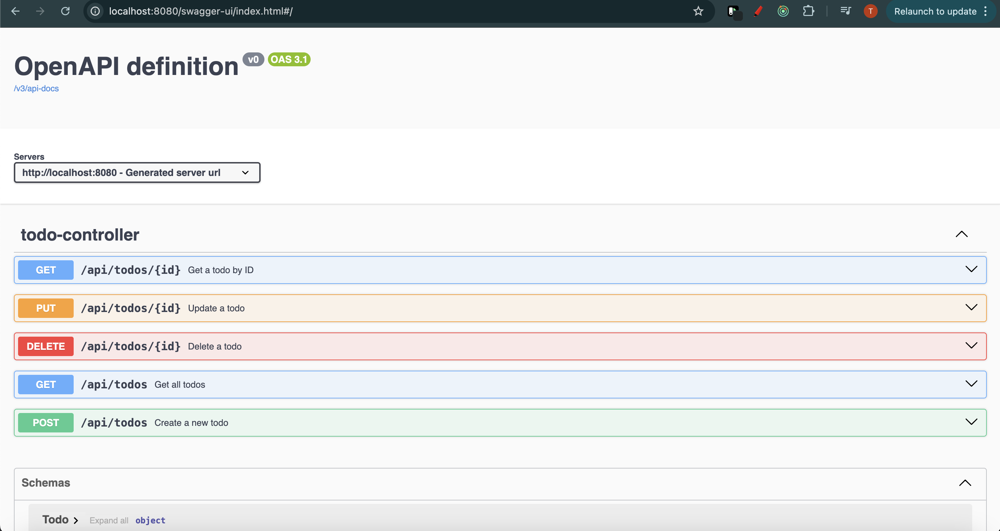

Here’s a clean and complete `README.md` for your **Todo API** built with **Spring Boot**:

---

````markdown
# 📝 Todo API

A simple RESTful API for managing todo items, built with **Java Spring Boot**.

## 🚀 Features

- Create, read, update, and delete (CRUD) todo items
- Input validation
- Exception handling for non-existing todos
- OpenAPI (Swagger UI) documentation

---

## 🛠️ Tech Stack

- Java 17+
- Spring Boot 3+
- Spring Web
- Spring Data JPA
- H2 / PostgreSQL (optional)
- Swagger UI (via springdoc-openapi)

---

## 📦 Getting Started

### Prerequisites

- Java 17 or later
- Maven

### Clone the project

```bash
git clone https://github.com/yourusername/todo-api.git
cd todo-api
```
````

### Build and run

```bash
./mvnw spring-boot:run
```

### Access the API

- Base URL: `http://localhost:8080/api/todos`

---

## 📚 API Endpoints

| Method | Endpoint          | Description             |
| ------ | ----------------- | ----------------------- |
| GET    | `/api/todos`      | Get all todos           |
| GET    | `/api/todos/{id}` | Get a todo by ID        |
| POST   | `/api/todos`      | Create a new todo       |
| PUT    | `/api/todos/{id}` | Update an existing todo |
| DELETE | `/api/todos/{id}` | Delete a todo by ID     |

---

## 🧪 Example JSON (POST/PUT)

```json
{
  "title": "Buy groceries",
  "description": "Milk, Bread, Eggs",
  "complete": false
}
```

---

## 📖 Swagger Documentation

Once the app is running, visit:

```
http://localhost:8080/swagger-ui.html
```

or

```
http://localhost:8080/swagger-ui/index.html
```

---

### 🔍 Swagger UI Preview



## ⚠️ Error Handling

If a todo with the given ID is not found, a `404 Not Found` will be returned with a message like:

```json
{
  "message": "Todo with ID 1 not found"
}
```

---

## 🧹 Project Structure

```
com.gmdt.todo
├── controller
│   └── TodoController.java
├── exception
│   └── TodoNotFoundException.java
├── model
│   └── Todo.java
├── repository
│   └── ITodoRepository.java
├── validator
│   └── ITodoValidator.java
└── TodoApiApplication.java
```

---

## 📝 License

This project is licensed under the MIT License. See `LICENSE` for details.
